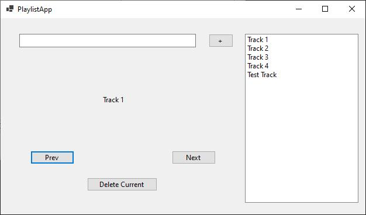

For this activity, you are required to build a playlist app which utilises a Doubly Linked List and allows the user to move between tracks, add tracks, remove tracks, and optionally, shuffle tracks.
 
You can consult the doubly linked list resources provided in the PROG7312 bot: https://landbot.pro/v3/H-1675272-74XV42DRXXYNXCV6/index.html or you can consult the guru videos 
 
Note: You can use WPF , MS Forms or ASP.net MVC.

