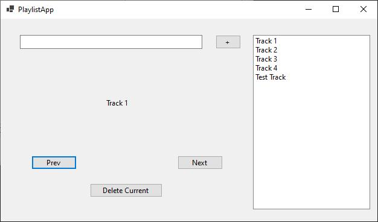

## SmartHome Management - Custom Dictionary

Create a WPF application to manage smart home devices using a custom dictionary data structure in C#. The application should allow users to add, update, and remove devices, and display the current list of devices and their statuses.

Implement a custom dictionary class to store keys and values. The custom class should have functionality to add a key value pair to the dictionary, update a dictionary item, remove an item given a key, get a value given a key, check for a given key, and receive all dictionary items as a collection.

