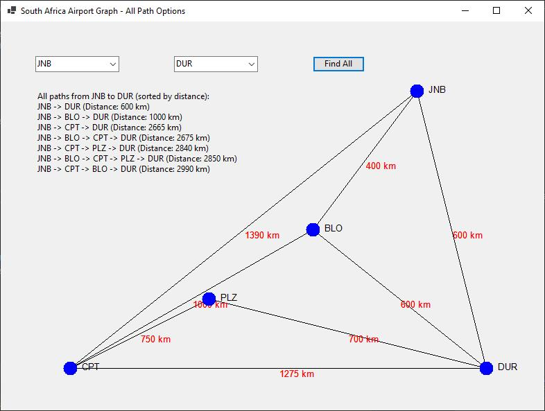

# Graphs - AirportGraph
You are required to implement a graph in C# to represent South African airports and their connections.
 

### Airports (Vertices):
Cape Town International Airport (CPT)
O.R. Tambo International Airport (JNB)
King Shaka International Airport (DUR)
Port Elizabeth International Airport (PLZ)
Bloemfontein Airport (BLO)

### Flight Connections (Edges) and Distances (in km):
CPT ↔ JNB: 1390 km
CPT ↔ DUR: 1275 km
CPT ↔ PLZ: 750 km
CPT ↔ BLO: 1000 km
JNB ↔ BLO: 400 km
JNB ↔ DUR: 600 km
DUR ↔ PLZ: 700 km
DUR ↔ BLO: 600 km
PLZ ↔ CPT: 750 km

## Activity 1: Graph Representation and Visualisation
Use a dictionary-based adjacency list to represent the airports and their direct flight connections.
Each airport should be a vertex, and each flight should be an edge with a weight representing the distance between the airports.
Visualize the airports and connections as nodes and edges on a graphical interface.

## Activity 2: Implement Dijkstra’s Algorithm
Implement Dijkstra’s algorithm to find all paths from a selected starting airport to a destination airport.
Allow the user can select the start and end airports to view all possible paths between two airports. Sort the paths by total distance in ascending order and display the results to the user.
 
 